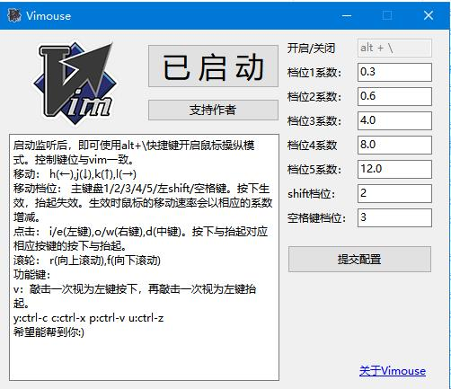

## 让你在键盘上使用vim键位直接操纵鼠标。 Control mouse with vim hot keys.

### 使用方法：

启动监听后，即可使用alt+\快捷键开启鼠标操纵模式。控制键位与vim一致。

移动： h(←),j(↓),k(↑),l(→)  

移动档位： 主键盘1/2/3/4/5/左shift/空格键。按下生效，抬起失效。生效时鼠标的移动速率会以相应的系数增减。

点击： i/e(左键),o/w(右键),d(中键)。按下与抬起对应相应按键的按下与抬起。

滚轮： r(向上滚动),f(向下滚动)

功能键：  
v：敲击一次视为左键按下，再敲击一次视为左键抬起。  
y:ctrl-c c:ctrl-x p:ctrl-v u:ctrl-z  

希望能帮到你:)

Press alt+\ to enable mouse controlling mode after started.

move： h(←),j(↓),k(↑),l(→)

move speed： 1/2/3/4/5/left shift/apace. Enabled when press down, disabled when loose up.The speed of mouse will effected by speed keys due to different vlaues of coefficient.

click： i/e(left key),o/w(right key),d(middle key).

scroll： r(roll up),f(roll down)

function keys：
v：click once for mouse left down. click another once for mouse left up.  
y:ctrl-c c:ctrl-x p:ctrl-v u:ctrl-z  

Hope it helps :)

* * *
### 如果你觉得不错，那就请我喝杯咖啡吧~
